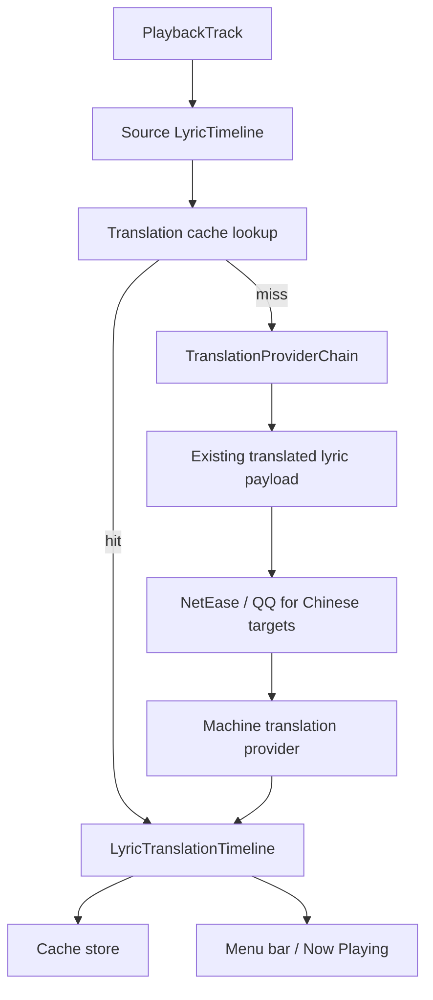

# Lyrics Translation Provider Design

## Context

LyricX already has translation state, cache, menu-bar display modes, and a `LyricTranslationService` boundary, but the current local implementation does not produce real translated text. It only produces optional Japanese romaji. When translation is enabled and no translated lines are available, the app now reports that no translation provider is configured.

This design adds real translation providers while preserving the existing model: `LyricTimeline` remains the timing source of truth, and `LyricTranslationTimeline` remains an enrichment layer keyed by source line identity and timestamp.

## Goals

- Provide real translated lyric text instead of only romaji.
- Prefer existing human-translated synced lyrics when available.
- Support Chinese translation sources such as NetEase Cloud Music and QQ Music where practical.
- Support multiple target languages through machine translation providers.
- Keep the menu bar native, single-line, and selected-layer-only.
- Keep provider failures explicit in settings and Now Playing without breaking source lyric display.

## Non-goals

- Do not mutate `LyricLine` or `LyricTimeline` to carry translations.
- Do not make the menu bar two-line or show source and translation simultaneously there.
- Do not require NetEase or QQ credentials for the app to show source lyrics.
- Do not ship hard-coded API secrets.
- Do not make unofficial Chinese music APIs the only translation path.

## Provider categories

LyricX should treat lyric-source providers and machine-translation providers as different capabilities.

### Lyric-source providers

These providers try to find existing lyric assets for the current track.

Examples:

- LRCLIB: source synced lyrics already used by LyricX.
- NetEase Cloud Music: potential source for synced Chinese translations and romaji-like lyric variants.
- QQ Music: potential source for synced Chinese translations and lyric variants.

Expected outputs:

- Source synced lyrics when no source timeline exists.
- Existing translated synced lyrics when the platform provides them.
- Optional romanization/pronunciation lines when available.

Constraints:

- NetEase and QQ are mainly useful for Chinese translation UX.
- Their public stability and legal/API terms must be evaluated before enabling a production provider.
- Track matching must be conservative; a bad match is worse than no translation.

### Machine-translation providers

These providers translate LyricX's current source timeline into a selected target language.

Candidate providers:

- Apple/System translation when the required macOS API and language pair are available.
- OpenAI-compatible endpoint for user-configured models.
- DeepL or Google Translate as future provider adapters.
- Local model providers as a later option.

Expected outputs:

- A translated line for each source `LyricLine` when possible.
- Missing translations represented as `nil`, never by shifted line mapping.

Constraints:

- Credentials must live outside source-controlled settings.
- Network, quota, and provider errors must surface in `translationStatus`.
- Whole-song translation is preferred over per-line translation to preserve context.

## Recommended provider chain

Use an `Auto` provider chain:

1. Read cached `LyricTranslationTimeline` for the exact track, source timeline fingerprint, target language, and romaji setting.
2. Use source-provided translation if the source lyric payload already includes a target-language translation.
3. If the target language is Chinese, try enabled Chinese lyric-source providers such as NetEase and QQ.
4. Try the selected machine-translation provider for any supported target language.
5. If no provider can produce translated text, publish `.failed("No translation provider configured")` or a more specific provider error.

The chain must stop at the first provider that returns a confident timeline with at least one translated line. It must not overwrite good cached or human-translated lyrics with machine translation unless the user explicitly refreshes and chooses a machine-only mode.

## Settings design

Add provider settings under the existing Translation settings page.

Fields:

- Translation: enabled/disabled.
- Target language: System, Simplified Chinese, Traditional Chinese, English, Japanese, Korean.
- Source mode:
  - Auto.
  - Existing lyric translations only.
  - Chinese lyric sources only.
  - Machine translation only.
- Chinese lyric sources:
  - NetEase Cloud Music.
  - QQ Music.
- Machine translation provider:
  - None.
  - Apple/System, when available.
  - OpenAI-compatible endpoint.
  - Future: DeepL, Google, local model.
- Provider status: concise current state and last error.

Default:

- Source mode: Auto.
- Chinese lyric sources: disabled until implemented and reviewed.
- Machine translation provider: None until a real provider is configured.

## Data flow



## API shape

Add provider-specific result metadata without changing menu-bar rendering:

```swift
public enum TranslationProviderKind: String, Codable, Sendable {
    case embeddedLyrics
    case netEaseCloudMusic
    case qqMusic
    case appleSystem
    case openAICompatible
}

public struct LyricTranslationProviderResult: Sendable {
    public let timeline: LyricTranslationTimeline
    public let providerKind: TranslationProviderKind
    public let confidence: Double
}

public protocol LyricTranslationProvider: Sendable {
    var kind: TranslationProviderKind { get }

    func translation(
        for track: PlaybackTrack,
        sourceTimeline: LyricTimeline,
        targetLanguage: TranslationLanguage,
        options: LyricTranslationProviderOptions
    ) async throws -> LyricTranslationProviderResult?
}
```

`LyricTranslationService` becomes the orchestration layer that runs the provider chain, applies cache policy, and returns a `LyricTranslationTimeline` plus status metadata to `AppModel`.

## Matching policy for NetEase and QQ

A Chinese lyric-source provider must only return translated lyrics when matching confidence is high.

Required match inputs:

- Track title.
- Artist.
- Duration when available.
- Album when available.

Acceptance rules:

- Exact or normalized title match required.
- Artist match required unless the platform metadata clearly aliases the artist.
- Duration difference should be within a small tolerance when duration is available.
- If multiple candidates tie, return no result instead of guessing.

Line mapping:

- Prefer synced translated lyric timestamps from the provider.
- Map translated lines to source lines by nearest timestamp within a small tolerance.
- Do not map by array index unless timestamps and line counts are both aligned.
- Missing or ambiguous lines become `nil`.

## Error handling

- Source lyrics remain visible for every provider failure.
- Menu bar continues using selected-layer fallback rules.
- Now Playing shows translation status and any available translated line below the current source line.
- Settings shows provider availability and configuration errors.
- Cache read failure is ignored.
- Cache write failure is best-effort and does not change UI state.

## Testing

Add tests for:

- Provider chain stops at cached or human-provided translations before machine translation.
- Provider chain tries Chinese lyric sources only for Chinese target modes unless explicitly configured otherwise.
- Provider chain falls through to machine translation for non-Chinese target languages.
- NetEase/QQ matching rejects ambiguous candidates.
- Timestamp mapping does not shift translations when a provider has missing lines.
- Machine translation partial output maps missing lines to `nil`.
- Provider errors publish failed status while source lyrics remain visible.

## Acceptance criteria

- Enabling translation with no provider configured produces an explicit failed status, not `available`.
- With a configured provider, LyricX can produce real `translatedText` lines.
- Chinese targets can use Chinese lyric-source providers when implemented and enabled.
- Non-Chinese targets can use a machine translation provider.
- Menu bar remains single-line and selected-layer-only.
- Now Playing displays translated text as secondary text under the current source lyric when available.
